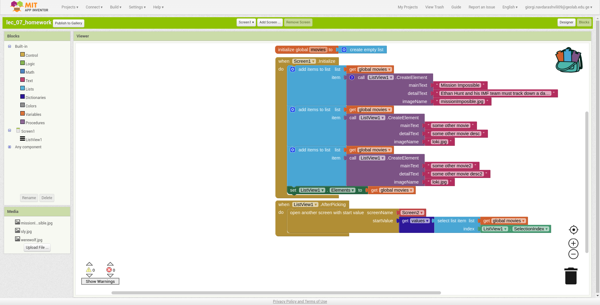

# მეშვიდე ლექციის დავალება

## პირველი ეკრანი
პირველ ეკრანზე გვაქვს ListView კომპონენტი, რომლის ელემენტი არის: სურათი და ფილმის სახელი.
ListView_ში ელემენტის არჩევისას უნდა გადავიდეთ მეორე ეკრანზე და ნავიგაციისას წავიღოთ: ფილმის სურათის მისამართი, სახელი, მოკლე აღწერა.

დიზაინი

!!!ყურადღება მიაქციე layout პარამეტრს, რომელშიც "Image, MainText" ავირჩიეთ.

ბლოკები

## მეორე ეკრანი
მეორე ეკრანზე გვაქვს სურათის და ორი ტექსტის(Label) კომპონენტი
სურათში ფილმის ქოვორ ფოტო გვაქვს პირველ Label კომპონენტში ფილმის სახელი, მეორეში ფილმის აღწერა.

დიზაინი

ბლოკები