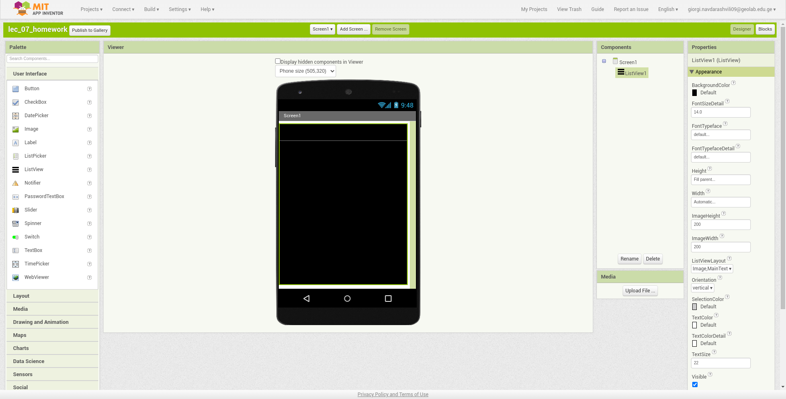
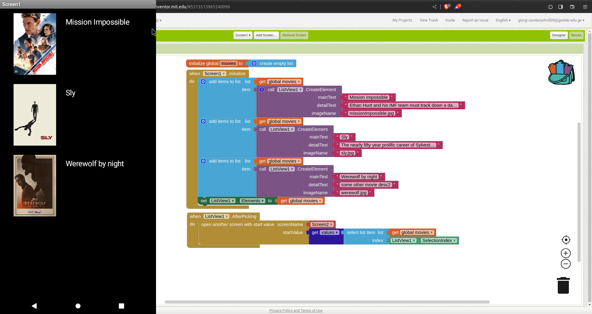

# მეშვიდე ლექციის დავალება

## პირველი ეკრანი
პირველ ეკრანზე გვაქვს ListView კომპონენტი, რომლის ელემენტი არის: სურათი და ფილმის სახელი.
ListView_ში ელემენტის არჩევისას უნდა გადავიდეთ მეორე ეკრანზე და ნავიგაციისას წავიღოთ: ფილმის სურათის მისამართი, სახელი, მოკლე აღწერა.

დიზაინი

!!!ყურადღება მიაქციე layout პარამეტრს, რომელშიც "Image, MainText" ავირჩიეთ.

ბლოკები

პირველ რიგში ვქმნით ცვლადს სახელად "movies" რომლის მნიშვნელობაც ცარიელი სიაა.

ფილმები აპლიკაციის ჩატვირთვისას უკვე უნდა ჩანდეს ჩვენს აპლიკაციაში. ამიტომ გამოვიყენებთ Initialize ბლოკს სადაც movies სიაში დავამატებთ
ჩვენთვის სასურველი რაოდენობის ელემენტებს. ბოლოს კი listView_ს Elements პარამეტრად მივუთითებთ ჩვენს მიერ შექმნილ ცვლადს "movies".
ბოლოს კი გამოვიყენებთ AfterPicking და SelectionIndex ბლოკებს ListView ბლოკების ჩამონათვლიდან. ასევე დაგვჭირდება open Another Screen with start value ბლოკი.

SelectionIndex ბლოკი დაგვიბრუნებს ListView_ში არჩეულ ელემენტს, რომელიც არის Dictionary ტიპის.
Dictionary სიის მსგავსი მონაცემის ტიპია რომელიც ელემენტებს ინახავს წყვილებად.
მაგალითად ListView_ში პირველ ფილმზე დაჭერისას გვიბრუნდება:
{
    "Text1":"Mission Impossible",
    "Text2":"Ethan Hunt and his IMF team must track down a dangerous weapon before it falls into the wrong hands.",
    "Image":"missionImpossible.jpg"
}

## მეორე ეკრანი
მეორე ეკრანზე გვაქვს სურათის და ორი ტექსტის(Label) კომპონენტი
სურათში ფილმის ქოვორ ფოტო გვაქვს პირველ Label კომპონენტში ფილმის სახელი, მეორეში ფილმის აღწერა.

დიზაინი

ბლოკები